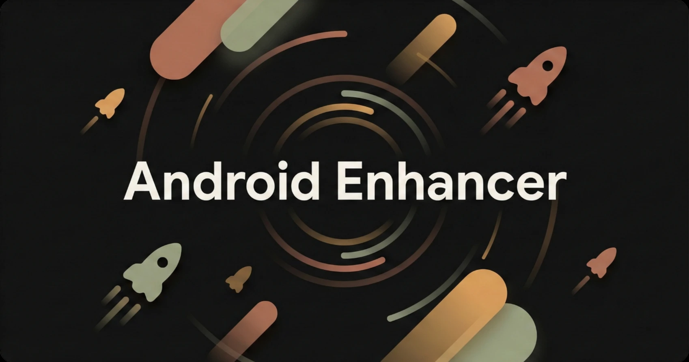
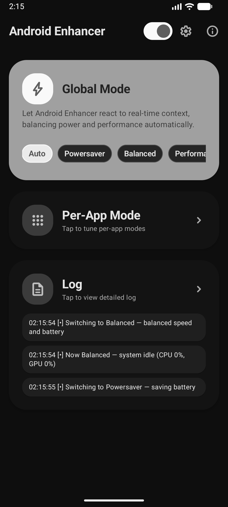
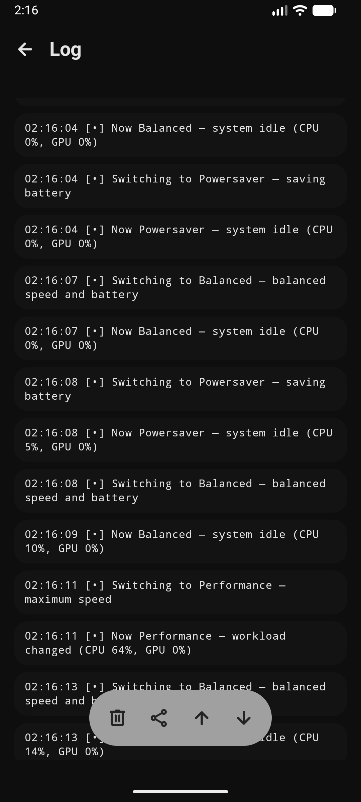
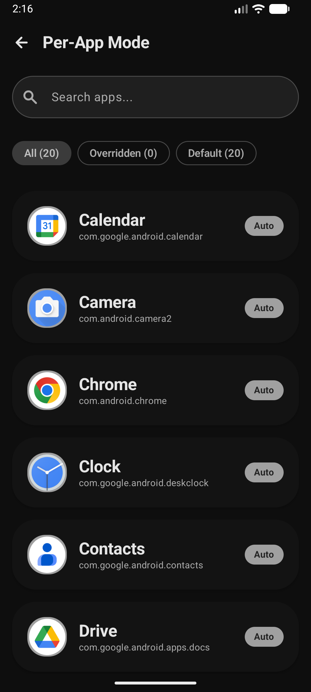
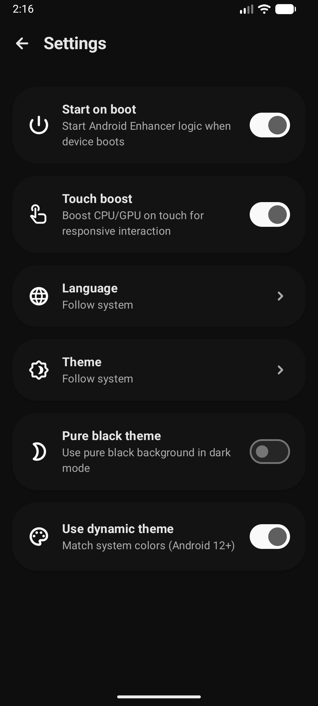
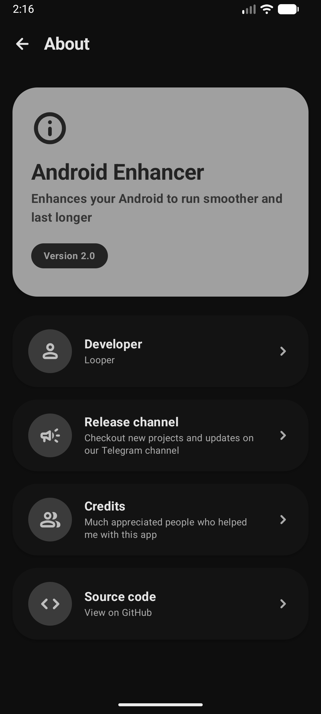

# Android Enhancer 🚀

Enhances your Android to run smoother and last longer.

## Download 📲

[Click here](https://www.pling.com/p/1875251/) to download the latest version of Android Enhancer.

## Working ⚙️

The core pipeline lives in the Rust core at [app/src/main/rust/src/lib.rs](app/src/main/rust/src/lib.rs). The JNI bridge exposes Auto, Powersaver, Balanced, Performance, and Gaming modes to the Kotlin layer.

## Screenshots 📱

## Credits 👥

- [Emad](https://t.me/emadseed) - Tester
- [Crunchy](https://t.me/A_littebit_Crunchy) - Tester
- [KTweak](https://github.com/tytydraco/KTweak) - BSD 2-Clause License
- [Uperf](https://github.com/yc9559/uperf) - Apache-2.0 License